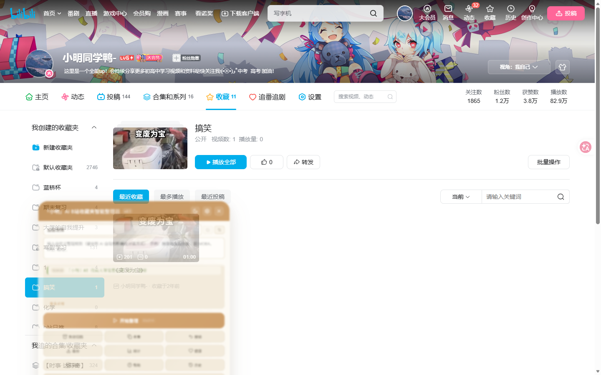
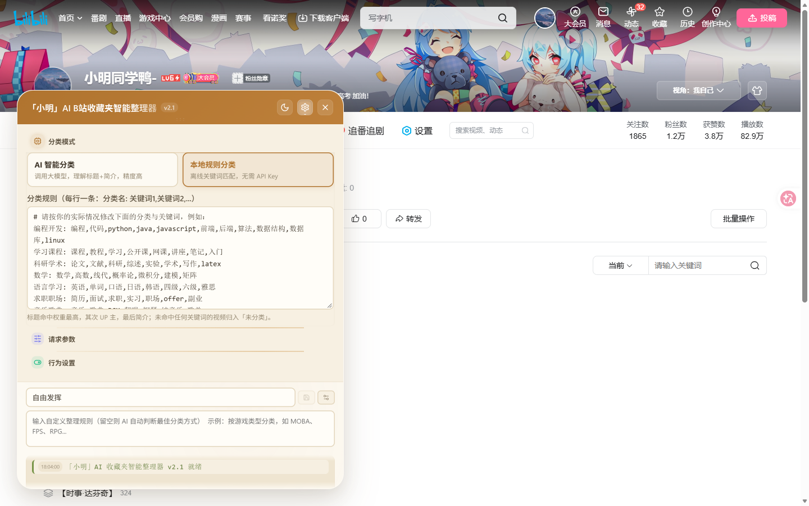
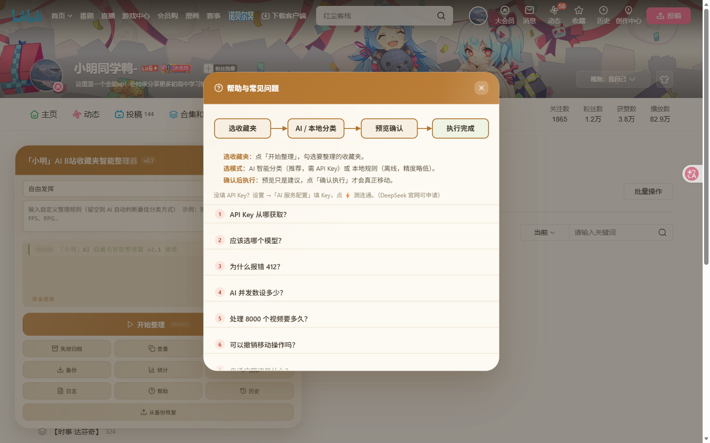
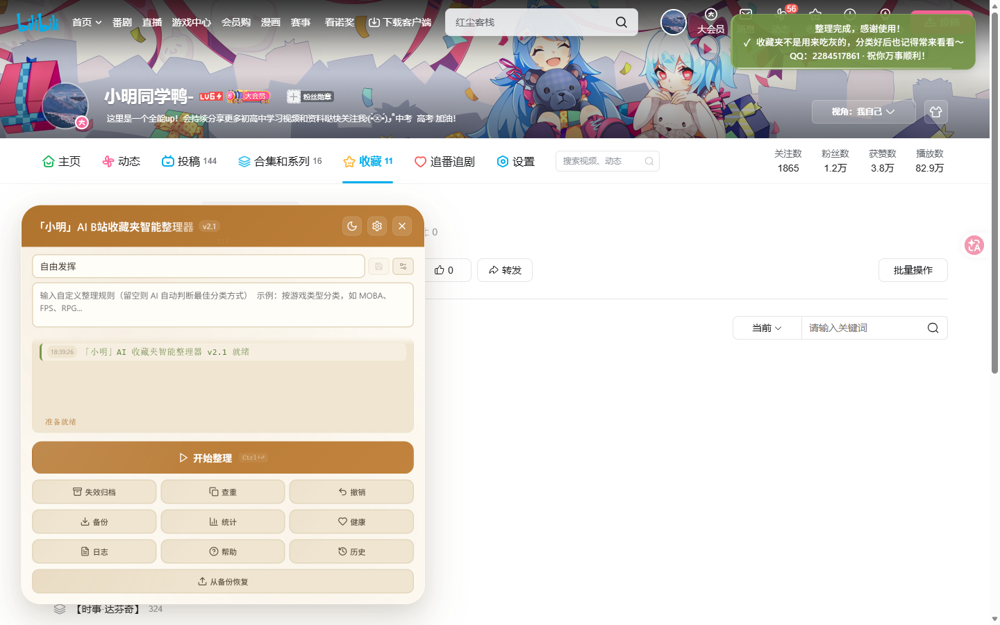
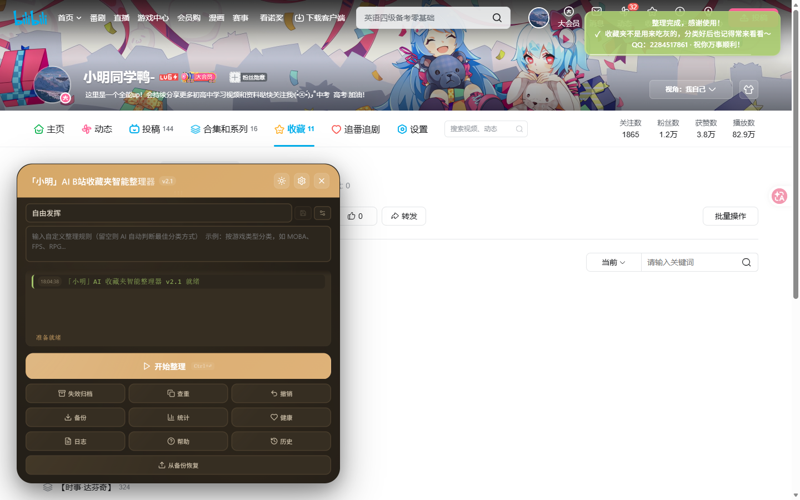
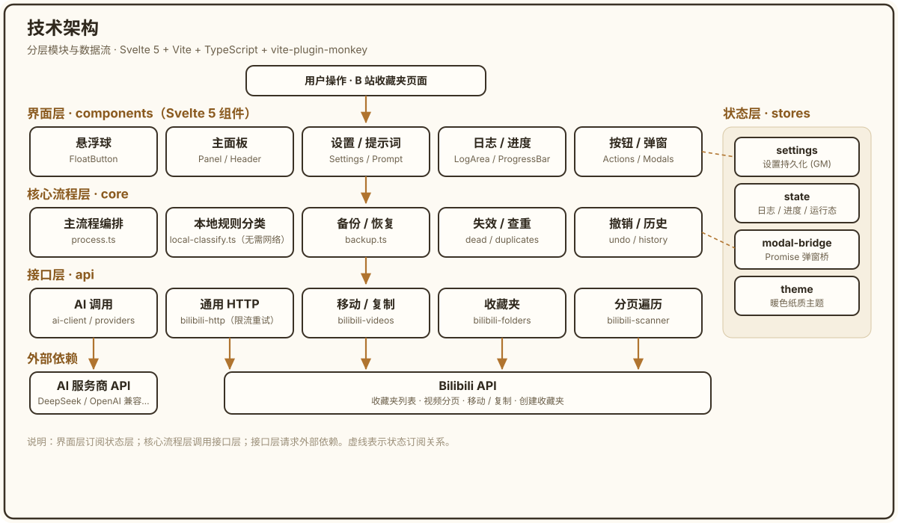
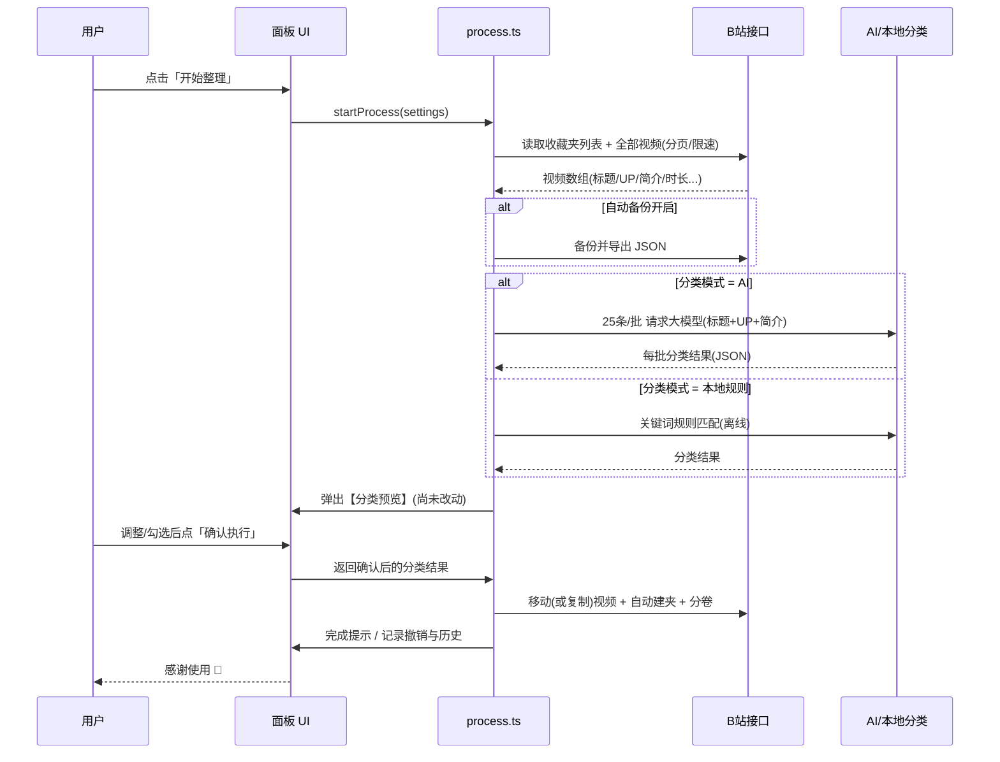

<p align="center">
  
</p>

# 「小明」AI B站收藏夹智能整理器

**简体中文** | [English](#english)

> 作者：**b站 小明同学鸭-**
>
> 一款运行在浏览器（油猴 / Tampermonkey）上的 Bilibili 收藏夹 AI 智能分类整理助手。把一个杂乱的大收藏夹，自动拆分归类到多个清晰的收藏夹中。

本项目基于开源仓库 **[madoka-chann/Bilibili-AI-Favorites-Organizer](https://github.com/madoka-chann/Bilibili-AI-Favorites-Organizer)** 二次开发增强，在 **分类质量、可交互性、隐私安全、界面观感、工程规范** 五个方向做了系统性改造。默认接入 DeepSeek 官方大模型，结合「标题 + UP主 + 简介」做深度语义分类，并坚持 **两阶段预览确认**（先给你看分类方案，你确认后才移动，绝不擅自改动你的收藏夹）。

---

<p align="center">
  <a href="https://raw.githubusercontent.com/xm2284/bili-ai-favorites-organizer/main/dist/bilibili-ai-favorites-organizer-pro.user.js">
    
  </a>
  &nbsp;
  <a href="https://github.com/xm2284/bili-ai-favorites-organizer/blob/main/dist/bilibili-ai-favorites-organizer-pro.user.js">
    
  </a>
</p>

> 点上方按钮安装（需先装 [Tampermonkey](https://www.tampermonkey.net/) 油猴扩展）。

<p align="center">
  <b>⭐ 如果这个工具帮到了你，欢迎点个 <a href="https://github.com/xm2284/bili-ai-favorites-organizer">Star</a> 支持一下～</b>
</p>

---

## 📌 与原版相比，新增/改进了什么？

> 原版是一套相当完整的骨架（多 AI 服务商、动画、缓存、去重、撤销等），本项目在保留其能力的基础上做了大量增强。下表为核心差异：

### A. 分类能力（最核心）

| 项 | 原版 | 本增强版 |
| :--- | :--- | :--- |
| 分类依据 | 仅 **标题 + UP主 + 播放量/时长** | **标题 + UP主 + 视频简介前 60 字**（`process.ts`），大模型能真正读懂内容，避免标题党误判 |
| 默认服务商 | Gemini | **DeepSeek 官方**（`deepseek-chat`），中文场景更稳 |
| 超时时间 | 120 秒（易被大 prompt 掐断） | **300 秒**，彻底解决 `AI 请求超时` |
| 默认批次 | 50 条 / 并发 2 | **25 条 / 并发 1**，单批 10s 内出结果，不超时、不触发风控 |
| **本地规则分类（全新）** | 无 | **无需 API Key、完全离线**：按 `分类名: 关键词...` 规则匹配，标题>UP主>简介加权，未命中进「未分类」（`core/local-classify.ts`） |
| 是否新建分类 | 固定“优先已有，必要时新建” | **可开关**「允许 AI 创建新分类」；关闭时只归入已有收藏夹 |

### B. 交互与安全（避免“AI 擅自操作”）

| 项 | 说明 |
| :--- | :--- |
| **两阶段预览确认强化** | 预览弹窗标题改为「分类预览 · 确认后才会执行」，顶部醒目提示「**尚未执行任何改动**」，确认按钮改为「✔ 确认执行（移动到 N 个分类）」，直接关闭不改任何数据 |
| **保留默认收藏夹（复制）** | 可开启：来源是「默认收藏夹」的视频用 B 站 `resource/copy` **复制**到新分类，默认夹保持不动（`copyVideos`） |
| **整理前自动备份** | 可开关（默认关）：整理前自动导出 JSON 并保留最近一次备份 |
| **从备份恢复（全新）** | 导入之前导出的 JSON，**按原收藏夹把视频搬回**（`restoreFromBackup`） |
| **取消不再报错** | 用户取消时提示「已取消整理（未做任何改动）」，而非红色错误 |
| **防重复注入** | `window` 标记 + 启动清理旧实例根节点 + `MutationObserver`，彻底解决“出现两个悬浮球” |
| **位置约束回视口** | 悬浮球/面板拖到屏幕外会自动回位，标题栏（拖动把手）永远可抓 |
| **智能连通性测试** | 测试显示文字结果：`连接成功（服务商·模型），可用模型 N 个` / 具体失败原因 |
| **API Key 防自动填充** | 输入框加 `autocomplete="new-password"` 等，且**清空内置默认 Key**，保护隐私 |
| **进度不再“卡死”** | 大收藏夹每 5 页汇报进度 + 「请耐心等待（只读不改）」提示；读取速度默认 1200→600ms |

### C. 界面（暖色纸质风，拒绝“AI 科技味”）

| 项 | 说明 |
| :--- | :--- |
| **全新配色主题** | 由蓝紫毛玻璃改为 **米色纸面 + 牛皮棕**（浅色）/ **暖咖**（深色），`variables.css` 全量重写 |
| **悬浮球 B 站配色** | 改为 B 站粉→蓝渐变（`#FB7299 → #00AEEC`），图标改为文件夹 |
| **精简动画** | 默认关闭花哨动画；移除标题流光、鼠标跟随光斑、星云粒子、弹窗极光、悬浮球呼吸环；进度条去彩虹色 |
| **界面更大更好读** | 面板 400→580px、内容区 60vh→72vh；全局字号放大 |
| **使用指南** | 首次自动弹出；含 **SVG 流程图**（选收藏夹→分类→预览确认→执行完成），内容精简 |
| **完成致谢** | 整理结束弹出感谢提示（含联系方式与寄语） |

### D. 工程规范与发布

| 项 | 说明 |
| :--- | :--- |
| 单元测试 | 新增 `local-classify.test.ts`（规则解析/权重/兜底），全套 **25 个测试通过** |
| 类型检查 | `svelte-check` **0 error**（重构掉原版 8 个类型错误） |
| 代码规范 | `eslint` **0 problems**（原版 22 个问题清零） |
| 元数据 | 脚本名/作者/license/homepageURL/supportURL/updateURL/downloadURL 全套 |
| 许可 | **MIT**（含原作者署名） |
| 资源 | `assets/banner.svg` 矢量 Banner + 多张真实界面截图 |

> 说明：本项目**保留并致谢**原版的全部能力（多服务商、去重、撤销、历史、统计、健康报告、Token 追踪、后端缓存、自适应限速等），并持续改进。

---

## 🖼️ 界面预览

| 主面板 | 分类模式（含本地规则） |
| :---: | :---: |
|  |  |

| 使用指南 | 分类预览（确认后执行） |
| :---: | :---: |
|  |  |

| 完成提示 | 暗色模式 |
| :---: | :---: |
|  |  |

---

## ✨ 功能特性

- **AI 深度分类**：综合标题、UP 主、简介摘要交给大模型判断。
- **本地规则分类**：无需联网与 API Key，关键词规则离线归类。
- **两阶段预览确认**：先预览分类方案，可增删改/合并，点「确认执行」才移动。
- **多 AI 服务商**：DeepSeek / 硅基流动 / Gemini / OpenAI / 通义千问 / Kimi / 智谱 / Groq / OpenRouter / Ollama / GitHub Models / Anthropic / 自定义 OpenAI 兼容端点。
- **失效视频归档**、**跨收藏夹查重/去重**。
- **备份与恢复**、**撤销历史**、**整理历史**、**统计 / 健康报告**、**日志导出**。
- **收藏夹上限自动分卷**（超过 B 站 1000 上限自动建「xxx2」）。
- **默认收藏夹保护（复制而非移动）**、**整理前自动备份**。
- **自适应限速 + 风控退避**。

---

## 🧭 技术架构

### 模块结构

<p align="center">
  
</p>

> （矢量图源文件：`assets/architecture.svg`，位图：`assets/architecture.png`）

### 整理流程时序



### 关键文件

```
src/
├─ main.ts                 # 注入入口：防重复注入 + 挂载 Svelte App
├─ App.svelte              # 根组件（悬浮球 + 面板 + Toast）
├─ api/
│  ├─ ai-client.ts         # 大模型调用（重试/超时/模型列表）
│  ├─ ai-providers.ts      # 各家服务商端点与鉴权
│  ├─ ai-prompt.ts         # 系统提示词（含简介特征 / 是否允许新建分类）
│  ├─ bilibili-http.ts     # POST/GET + 412 风控指数退避
│  ├─ bilibili-videos.ts   # 移动 move / 复制 copy / 批量删除
│  ├─ bilibili-folders.ts  # 收藏夹列表/创建（带缓存）
│  └─ bilibili-scanner.ts  # 通用分页遍历器
├─ core/
│  ├─ process.ts           # 主流程编排（抓取→分类→预览→移动→报告）
│  ├─ local-classify.ts    # ★ 本地规则分类（无需 AI）
│  ├─ backup.ts            # 备份 / 从备份恢复
│  ├─ dead-videos.ts       # 失效视频扫描/归档/删除
│  ├─ duplicates.ts        # 跨收藏夹查重去重
│  ├─ undo.ts / history.ts # 撤销与历史
│  └─ panel-actions.ts     # 面板动作（含整理前自动备份、恢复）
├─ components/             # Svelte 组件（面板/设置/弹窗/预览…）
├─ stores/                 # settings / state / modal-bridge / theme
├─ utils/                  # 常量、时间、下载、gm 封装
└─ styles/variables.css    # ★ 暖色纸质主题设计变量
```

---

## 🚀 安装

### 方式一：从脚本文件安装（推荐）

1. 浏览器安装 **[Tampermonkey](https://www.tampermonkey.net/)**（油猴）扩展；
2. 打开本仓库 `dist/bilibili-ai-favorites-organizer-pro.user.js`，或点击下方链接安装：

   ```
   https://raw.githubusercontent.com/xm2284/bili-ai-favorites-organizer/main/dist/bilibili-ai-favorites-organizer-pro.user.js
   ```

3. 油猴弹出安装页，点击「安装」即可。

### 方式二：本地构建

```bash
npm install
npm run build
# 产物：dist/bilibili-ai-favorites-organizer-pro.user.js
```

---

## 📖 使用（三步）

1. **选收藏夹**：打开 B 站个人空间收藏夹页，点击右下角悬浮球 → 点「开始整理」→ 勾选要整理的收藏夹。
2. **选模式**：
   - **AI 智能分类**（推荐）：在「设置 → AI 服务配置」填入 API Key（如 DeepSeek：`platform.deepseek.com` 申请，形如 `sk-xxxx`），可点 ⚡ 测试连通。
   - **本地规则分类**：无需 Key，在「设置 → 分类模式」里维护关键词规则。
3. **确认后执行**：查看分类预览，可手动调整，点「确认执行」才会移动视频；直接关闭不会改动任何数据。

### 本地规则格式

每行一条：`分类名: 关键词1,关键词2,...`（以 `#` 开头的行忽略）

```
编程开发: 编程,代码,python,java,前端,后端,算法,数据库
学习课程: 课程,教程,学习,公开课,网课,讲座
音乐歌曲: 音乐,歌曲,BGM,翻唱,钢琴,纯音乐
```

匹配权重：标题 > UP 主 > 简介；未命中任何关键词的视频进入「未分类」。

---

## 🔒 隐私

- API Key 仅保存在你浏览器本地的油猴存储（`GM_setValue`）中，不会上传到任何第三方服务器（除你自己配置的 AI 服务商端点）。
- 视频数据仅在你浏览器与 B 站 / 你所选的 AI 服务商之间传输。
- 本增强版**未内置任何 API Key**。

---

## 🛠️ 开发

```bash
npm install       # 安装依赖
npm run dev       # 开发模式
npm run build     # 构建 userscript
npm test          # 单元测试 (vitest)
npm run typecheck # 类型检查 (svelte-check)
npm run lint      # ESLint
npm run format    # Prettier 格式化
```

技术栈：**Svelte 5 + Vite + TypeScript + vite-plugin-monkey + GSAP**。

---

## 🙏 致谢与版权（Credits）

- **本项目整理与增强**：b站 小明同学鸭-
- **原开源项目作者**：[madoka-chann](https://github.com/madoka-chann)（B站-是小圆_喲）
- **最初模板提供**：B站某不知名的根号三（[原视频](https://www.bilibili.com/video/BV1LifmBgEPZ/)）
- **开源许可**：[MIT](./LICENSE)。保留原作者署名与版权。

---

## 更新日志

- **2.1.0**
  - 分类：默认 DeepSeek 官方；特征加入视频简介；超时 300s；批次 25/并发 1；新增本地规则分类模式；新增「允许 AI 创建新分类」开关。
  - 交互/安全：两阶段预览确认强化；默认收藏夹保护（复制）；整理前自动备份（可选）；从备份恢复；取消不报错；防重复注入；位置约束回视口；连通性测试显示结果；API Key 防自动填充并清空内置 Key。
  - 界面：暖色纸质主题；悬浮球 B 站配色；精简动画；面板放大；字号放大；使用指南（SVG 流程图）；完成致谢。
  - 工程：新增本地分类单元测试；修复全部类型错误与 ESLint 问题；补全脚本元数据；MIT 许可；新增 Banner 与截图。

---

## 反馈

如果这个工具帮到了你，欢迎 Star ⭐。有问题或建议请到 [Issues](https://github.com/xm2284/bili-ai-favorites-organizer/issues) 反馈。

---

## English

### Bilibili AI Favorites Organizer (Xiaoming)

> By **b站 小明同学鸭-** ([@xm2284](https://github.com/xm2284))

A **Tampermonkey / userscript** that automatically organizes your messy Bilibili favorite folders into clean, themed folders using AI.

It is an enhanced fork of **[madoka-chann/Bilibili-AI-Favorites-Organizer](https://github.com/madoka-chann/Bilibili-AI-Favorites-Organizer)**.

**What's new vs. upstream**

- **Better classification**: uses *title + uploader + video description* (upstream only used title); defaults to **DeepSeek official**; timeout 120s → 300s; batch 50 → 25.
- **Local-rule mode (new)**: fully offline keyword-based classification, **no API key required**.
- **Preview before move**: shows the classification plan first; nothing is moved until you click **Confirm**.
- **Keep default folder**: optionally **copy** (not move) from the default folder so it stays untouched (uses Bilibili's copy API).
- **Backup / restore**: auto-backup before organizing (optional); restore from an exported JSON.
- **Safer UX**: cancel is no longer an error; duplicate-injection guard; panels clamp into viewport; connectivity test shows the result; API-key field resists browser autofill.
- **Warm paper UI**: beige/brown theme (no blue-purple "AI" look), bigger panel and fonts, concise in-app guide.
- **Engineering**: unit tests, 0 type errors, 0 ESLint problems, full userscript metadata, MIT license, banner + screenshots.

**Install**

1. Install [Tampermonkey](https://www.tampermonkey.net/).
2. Open this link (or the file in `dist/`):
   ```
   https://raw.githubusercontent.com/xm2284/bili-ai-favorites-organizer/main/dist/bilibili-ai-favorites-organizer-pro.user.js
   ```
3. Click **Install** on the Tampermonkey page.

**Usage**

1. Open your Bilibili space favorites page, click the floating button → **Start** → pick folders.
2. Choose a mode: **AI** (recommended; paste a DeepSeek API key in Settings) or **Local rules** (offline).
3. Review the preview, adjust if needed, then click **Confirm** to move.

**Privacy**: the API key is stored only in your local userscript storage; no data is sent anywhere except the AI provider you configure.

**Credits & License**

- Enhanced by **b站 小明同学鸭-**.
- Original project by **[madoka-chann](https://github.com/madoka-chann)** (B站-是小圆_喲); initial template by B站某不知名的根号三.
- Licensed under **[MIT](./LICENSE)**.
